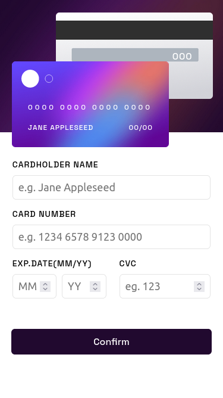

# Interactive card details form

My solution for the [Interactive card details form challenge on Frontend Mentor](https://www.frontendmentor.io/challenges/interactive-card-details-form-XpS8cKZDWw) using *React*.

## Table of contents

- [Overview](#overview)
  - [The challenge](#the-challenge)
  - [Screenshot](#screenshot)
  - [Links](#links)
- [My process](#my-process)
  - [Built with](#built-with)
  - [What I learned](#what-i-learned)
- [Author](#author)

## Overview

### The challenge

Users should be able to:

- Fill in the form and see the card details update in real-time
- Receive error messages when the form is submitted if:
  - Any input field is empty
  - The card number, expiry date, or CVC fields are in the wrong format
- View the optimal layout depending on their device's screen size
- See hover, active, and focus states for interactive elements on the page

### Screenshot

<table>
        <tr>
            <td>
                
            </td>
		    <td>
                
            </td>
			            <td>
                
            </td>
        </tr>
</table>

### Links

- Solution URL: [https://www.frontendmentor.io/solutions/interactive-card-details-using-flexbox-nEKnaUfFvr](https://www.frontendmentor.io/solutions/interactive-card-details-using-flexbox-nEKnaUfFvr)
- Live Site URL: [https://interactive-form-gmaitor.vercel.app/](https://interactive-form-gmaitor.vercel.app/)

## My process

### Built with

- Semantic HTML5 markup
- CSS custom properties
- Flexbox
- [React](https://reactjs.org/) - JS library
- [Vite](https://vitejs.dev/) - Build tool

### What I learned

This challenge has helped me to improve my layout skills and to use my own hooks to manage the form and to better understand how the context works in React.

## Author

- Frontend Mentor - [@AitorGallardo](https://www.frontendmentor.io/profile/AitorGallardo)

